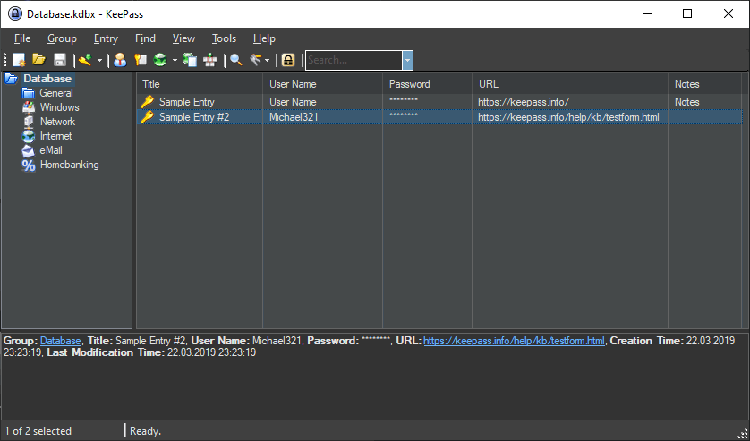
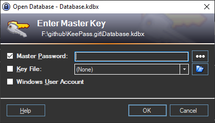
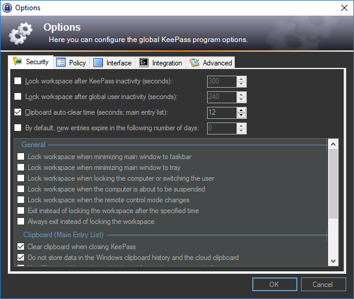

# KeeTheme

[](https://github.com/xatupal/KeeTheme/releases/latest)
[](https://github.com/xatupal/KeeTheme/releases/latest)
[](https://github.com/xatupal/KeeTheme/releases/latest/download/KeeTheme.plgx)

KeePass Plugin

Plugin changes the appearance of KeePass, to make it look better at night. 

You can enable it using hotkey `CTRL+T` or using the menu `Tools -> DarkTheme`.

(You can change the hotkey in the [options](docs/KeePassDarkThemeCustomOptions.png) `Tools -> Options... -> KeeTheme`)

### Customizations

The plugin allows you to create your own theme.

Just download [theme template](themes/KeeTheme.ini) and put it in the plugins folder.

### Installation

Copy [KeeTheme.dll](https://github.com/xatupal/KeeTheme/releases/latest/download/KeeTheme.dll) or [KeeTheme.plgx](https://github.com/xatupal/KeeTheme/releases/latest/download/KeeTheme.plgx) to the KeePass Plugins directory or install via [Chocolatey](https://chocolatey.org):

```
choco install keepass-plugin-keetheme
```

### Note

KeePass was created using standard Windows controls, which unfortunately were not designed for easy customization. They are extremely resistant to any attempts to change their appearance, especially from a plugin which has no control over their creation.

Therefore the plugin is not perfect and will never be, but is good enough to use it.

### Screenshots






