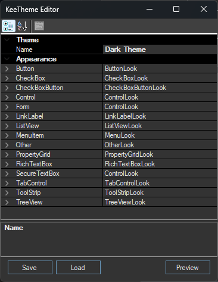
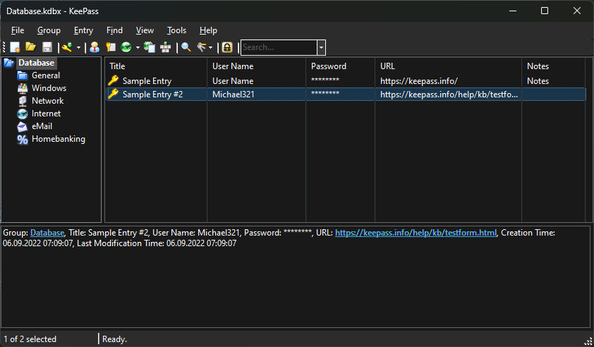
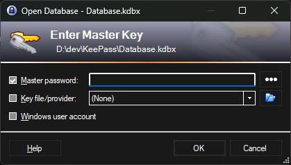
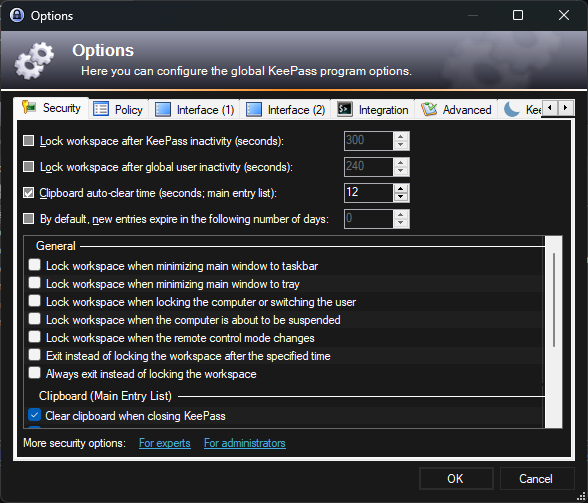

# KeeTheme

[](https://github.com/xatupal/KeeTheme/releases/latest)
[](https://github.com/xatupal/KeeTheme/releases/latest)
[](https://github.com/xatupal/KeeTheme/releases/latest/download/KeeTheme.plgx)

KeePass Plugin

This plugin changes the appearance of KeePass to make it look better at night.

You can enable it using the hotkey `CTRL+T` or through the menu `Tools -> DarkTheme`.

### Options

In [options](docs/KeePassDarkThemeCustomOptions.png) `Tools -> Options... -> KeeTheme` you can:
* Select a theme
* Create your own theme
* Change the default hotkey
* Auto-sync with the Windows 10 theme

### Customizations

You can use the built-in theme editor to create your own theme.
Custom themes should be saved in the plugins folder.




### Installation

Copy [KeeTheme.dll](https://github.com/xatupal/KeeTheme/releases/latest/download/KeeTheme.dll) or [KeeTheme.plgx](https://github.com/xatupal/KeeTheme/releases/latest/download/KeeTheme.plgx) to the KeePass Plugins directory or install via [Chocolatey](https://community.chocolatey.org/packages/keepass-plugin-keetheme#install):

```
choco install keepass-plugin-keetheme
```

### Note

KeePass was created using standard Windows controls, which unfortunately were not designed for easy customization. They are extremely resistant to any attempts to change their appearance, especially from a plugin that has no control over their creation.

Therefore, the plugin is not perfect and never will be, but it is good enough to use.

### Screenshots
#### DarkTheme


#### DarkThemeWin11





